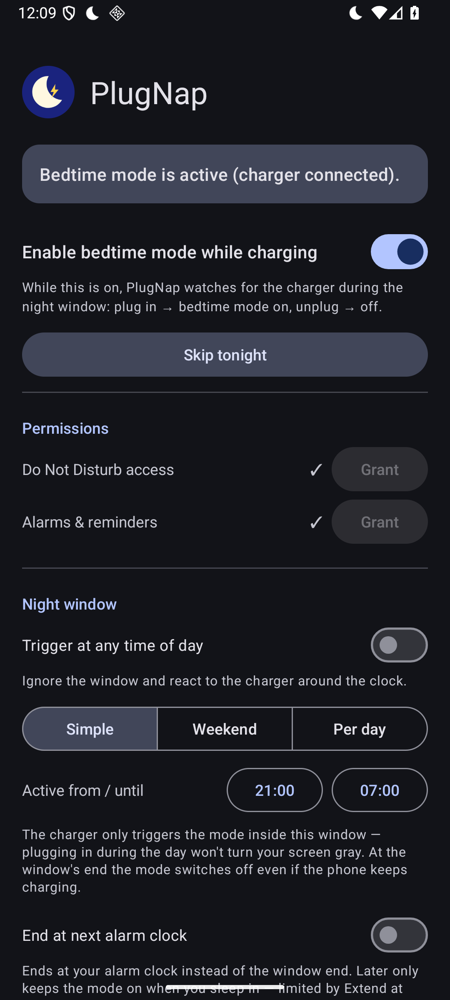
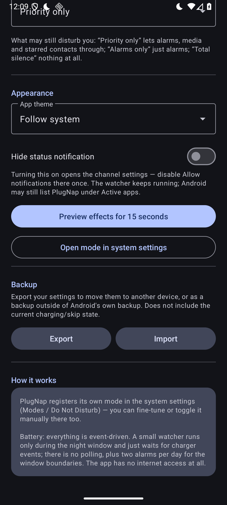

# PlugNap

[](LICENSE)
[](https://github.com/Georg912/plugnap/releases)
[](#limitations)

> *Plug in. Nap well.* — 🇩🇪 [Deutsche Version](README.de.md)

**Bedtime mode while charging — for Android 15+ (built for GrapheneOS on the Pixel).**

<p>


</p>

PlugNap fills a gap that only the proprietary Tasker used to cover: it
registers its own `AutomaticZenRule` with **`ZenDeviceEffects`** and
activates it the moment you plug in the charger — including the screen
effects that otherwise only the system schedule can switch:

- **Grayscale** (`setShouldDisplayGrayscale`)
- **Always-on display off** (`setShouldSuppressAmbientDisplay`)
- **Dim wallpaper** (`setShouldDimWallpaper`)
- **Dark theme** (`setShouldUseNightMode`)

Unplug — or let the night window end — and everything switches back.

## Features

- Configurable **night window** (default 21:00–07:00), separate weekend
  times for Friday/Saturday nights, or round-the-clock triggering
- **Charger-type filter** (power adapter / USB / wireless), activation
  delay (0–10 min) and unplug grace period (0 s–2 min)
- **"Skip tonight"** in the app and in the notification, **end at your
  next alarm clock**, quick-settings tile, 15-second effect preview
- Notification-filter choice (Priority / Alarms only / Total silence),
  app theme (system/light/dark), hideable status notification

## How it works

- The night window is bounded by **exact alarms**. Only inside the window
  does a small foreground service run, listening for
  `ACTION_POWER_CONNECTED`/`DISCONNECTED` (these broadcasts cannot be
  manifest-registered since Android 8).
- Charger in → zen rule active (DND + effects). Charger out → rule off.
- The rule shows up as a regular **mode** in the system settings
  (Do Not Disturb / Modes) where it can also be toggled and fine-tuned
  manually.
- Everything is event-driven — no polling, no measurable battery impact,
  and the app has **no internet permission at all**.

## Required permissions

| Permission | Why |
|---|---|
| Do Not Disturb access | create/toggle the `AutomaticZenRule` + `ZenDeviceEffects` |
| Alarms & reminders (exact alarms) | punctual window start + permitted service start from the background |
| Notifications | the service's low-key status notification (IMPORTANCE_MIN) |

No internet, no Google services, no analytics. GPLv3.

## Building

```bash
./gradlew assembleDebug        # APK: app/build/outputs/apk/debug/
./gradlew assembleRelease      # signed if the signing properties are set
```

Requirements: JDK 17+ (a full JDK, not just a JRE), Android SDK Platform 35.

### Tests

```bash
./gradlew test    # JVM unit tests: window logic (Schedule) + dropdown mapping
```

The tests run without an emulator and lock in, among other things, the
weekend/midnight window math and the dropdown regression from v1.4.0.

### Release signing

Keystore and password deliberately live **outside** the repo, in
`~/.gradle/gradle.properties`:

```properties
ZENDOCK_KEYSTORE=/path/to/release.jks    # property names are historical
ZENDOCK_KEYSTORE_PW=…
ZENDOCK_KEY_ALIAS=zendock
```

Without these properties `assembleRelease` builds unsigned. **Back up the
keystore!** Updates can only be installed with the same key.

## Installing

**Recommended: [Obtainium](https://github.com/ImranR98/Obtainium).** Add
this repository as an app source:

```
https://github.com/Georg912/plugnap
```

Obtainium installs the signed APK straight from the GitHub releases and
notifies you about updates — no store account, no middleman, and the
developer signature stays intact across updates.

Alternatively, download the APK manually from the
[releases page](https://github.com/Georg912/plugnap/releases), or via adb:

```bash
adb install app/build/outputs/apk/release/app-release.apk
```

Then, inside the app: grant both permissions, flip the main switch, and
verify with "Preview effects for 15 seconds".

## Limitations

- Android 15 (API 35) minimum — the `ZenDeviceEffects` API doesn't exist
  before that.
- `TYPE_BEDTIME` is reserved for the system wellbeing app; the rule
  therefore uses `TYPE_OTHER` (functionally identical, just categorized
  differently).

## License

Copyright © 2026 Georg FJ Hufnagl.

This program is free software: you can redistribute it and/or modify it
under the terms of the **GNU General Public License, version 3 or later**
(GPL-3.0-or-later), see [LICENSE](LICENSE). Dependencies (AndroidX,
Material Components) are Apache-2.0 licensed and compatible with the GPLv3.
